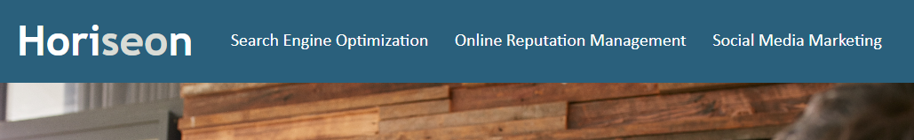

# <h1 align="center">Horiseon Demo Site</h1>

## Description

This project is a showcase of proper HTML formatting and element usage. Included would be - <ul><li>Comments</li><li>Alt-tags on img elements</li><li>And proper HTML/CSS usage</li></ul> Considering what the project includes, the main motivation behind this is to further solidify concepts in programming best practices.

## Features
After examining the files, you will notice that semantic elements are ordered correctly, accessibility elements have been included and all CSS has been consolidated. 

## Screenshot
 

## Live Demo
<a href="https://ryjmcnamee.github.io/horiseonDemoSite/">See Here...</a>